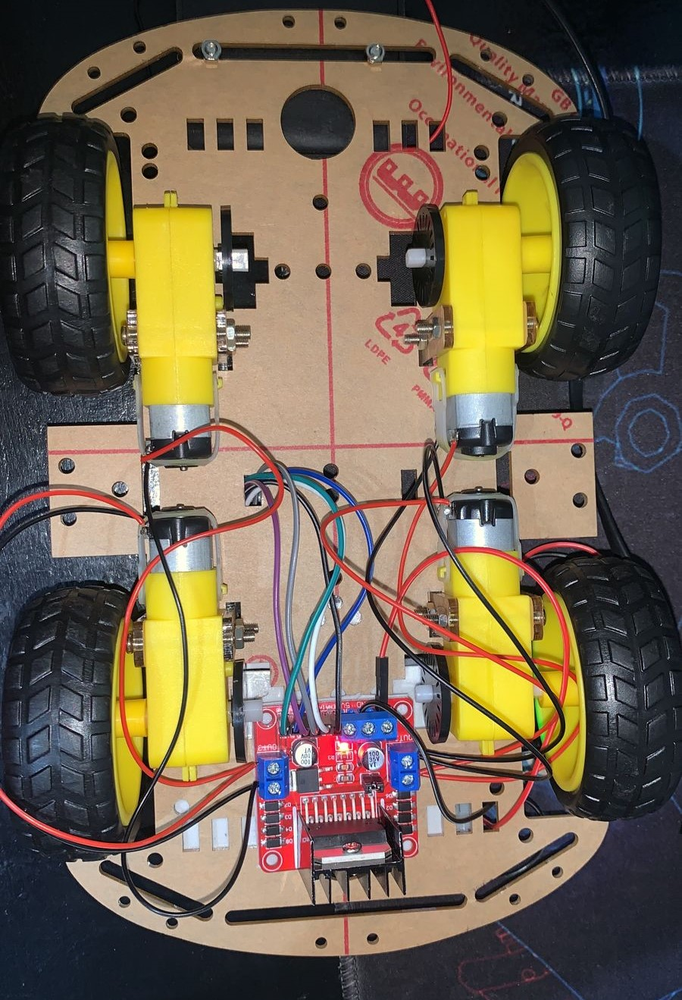

# *TRABALHO DE CONCLUSÃO DE CURSO - RetroRide*.

## FATEC - Ribeirão Preto.

### Diagrama de caso de uso.

### Diagrama de classes.

**_Carro robô montado_:**

**PARTE INTERNA**

**PARTE SUPERIOR**

